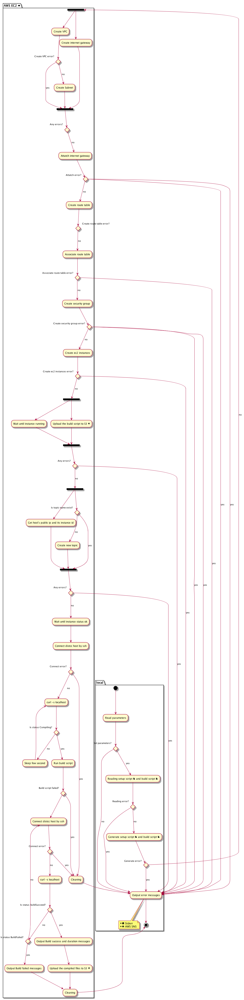

# edcc

[](https://app.codacy.com/app/falgon/edcc?utm_source=github.com&utm_medium=referral&utm_content=falgon/edcc&utm_campaign=Badge_Grade_Dashboard)
[](https://travis-ci.org/falgon/edcc)

Simple and tiny comprehensive management tool for 
distributed compilation using [distcc](https://github.com/distcc) on AWS EC2.

## Usage

```sh
$ ./dst/edcc --help
Usage of ./dst/edcc:
  -bucket-name string
        bucket name
  -cc string
        C compiler (default "gcc")
  -cidr string
        cidr block (default "10.0.0.0/16")
  -cxx string
        C++ compiler (default "g++")
  -image-id string
        image id (default "ami-940cdceb")
  -input string
        input script
  -instance-num int
        the number of running instance (default 1)
  -instance-type string
        instance type (default "t2.medium")
  -key-name string
        key name
  -key-path string
        key path (default "./")
  -notification-endpoint string
        notification endpoint
  -region string
        region setting (default "ap-northeast-1")
  -role-name string
        role name
  -setup-script string
        setup script path
  -subnet string
        subnet block (default "10.0.0.0/24")
  -topic-name string
        topic name
```
First of all, load setup script and build script.
Each script to be read can receive information at the time of execution by using a certain variable.
The list of available variables is as follows.

| variable name | description |
| :--: | :--: | 
| `{{.Region}}` | Region. If you set `-region="ap-northeast-1"`, it replaced `ap-northeast-1`. |
| `{{.InstanceCount}}` | The number of instances. If you set `-instance-num=5`, it replaced `5`. |
| `{{.BucketName}}` | The bucke name. If you set `-bucket-name="foo-bucket"`, it replaced `foo-bucket`. |
| `{{.TopicName}}` | The topic name. If you set `-topic-name="foo-topic"`, it replaced `foo-topic`. |
| `{{.Distcc}}` | The C compiling command. If you set `-cc="gcc"`, it replaced `distcc gcc`. |
| `{{.Distcxx}}` | The C++ compiling command. If you set `-cxx="g++"`, it replaced `distcc g++`. |
| `{{.ScriptName}}` | The build script name. If you set `-input="build.sh"`. it replaced `build.sh`. |
| `{{.CoopTag}}` | Tag name given to all EC2 instances that perform distributed compilation. It replaced `edcc-AutoConstruct`. |
| `{{.AccessKeyID}}` | Access key ID. Read exported value or value from credential file., Access key ID. You from the export value or credential file to read the value. |
| `{{.SecretAccessKeyID}}` |  Seekred access key ID. Read the value exported or value from the credential file., Read the value from the seek red access key ID. Export value or credential file. |
| `{{.Include_WriteStatus}}` | Include built-in shell script functions to use to notify you that compilation was successful. This will include the `write_success` function, `write_failed` function, `write_status` function and some other functions. See /build_script_example for actual usage. |

See /build_script_example for examples of these usage.

## Example of execution

```sh
$ make get
$ make
$ make run
Created VPC: vpc-0d2a44807dbb00dda
Created subnet: subnet-0cd08feea79c49d96
Created security group: sg-09c072546705fa3fe
Starting instances:
        * i-0cc9f0c80afc0f990
        * i-0755501e976b67e34
Waiting for running...done
Waiting for returning status ok...done
Checking host status...
        Status: Initializing (2018-08-12 19:13:25.4288026 +0900 JST m=+170.084816432)
        Status: Initializing (2018-08-12 19:13:35.576590703 +0900 JST m=+180.232604576)
        Status: Initializing (2018-08-12 19:13:45.726678649 +0900 JST m=+190.382692489)
        Status: Initializing (2018-08-12 19:13:55.876290007 +0900 JST m=+200.532303796)
        Status: Initializing (2018-08-12 19:14:06.028975147 +0900 JST m=+210.684988921)
        Status: Initializing (2018-08-12 19:14:16.172539951 +0900 JST m=+220.828553752)
        Status: Initializing (2018-08-12 19:14:26.316517246 +0900 JST m=+230.972531063)
        Status: Initializing (2018-08-12 19:14:36.460094922 +0900 JST m=+241.116108767)
        Status: Initializing (2018-08-12 19:14:46.628477795 +0900 JST m=+251.284491624)
done

Starting build: 2018-08-12 19:14:56.768230265 +0900 JST m=+261.424244188
Executing - kernelcompile.sh

Build succeed: (2018-08-12 19:14:57.720121735 +0900 JST m=+262.376135464)
Duration: 951.891276ms
Shutting down...done
Cleanup security group...done
Cleanup subnet...done
Cleanup gateway...done
Cleanup VPC...done
All OK.
```

## Activity diagram

Here is the ugly activity diagram.

<div style="height: 500px; overflow-y: scroll;">

</div>
